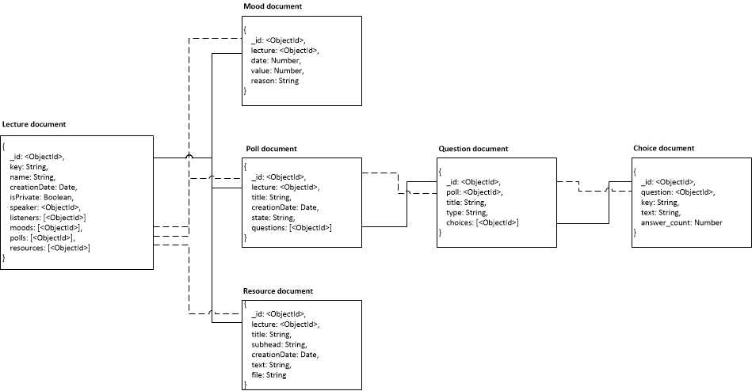

# Project Report

## Administrative information

### Team

Last name, first name | Github id   | Role
----------------------|-------------|-------------------------
D'Agostino, Eléonore  | [paranoodle](https://github.com/paranoodle) | 
Ghozlani, Karim       | [gweezer7](https://github.com/gweezer7)     | 
Kammoun, Yassin       | [yibnl](https://github.com/yibnl)           | 
Ntawuruhunga, Paul    | [paulnta](https://github.com/paulnta)       | 

## Table of Contents
1. [Introduction](#Intro)
1. [User Guide](#Guide)
1. [Design](#Design)
    1. [System overview](#Overview)
    1. [User interface](#Interface)
    1. [Database](#Database) 
    1. [REST API](#RestAPI)
    1. [Design patterns](#Patterns)
1. [Implementation](#Implementation)
    1. [Structure](#Structure)
    1. [Test data generation](#Datagen)
    1. [Selected aspects](#Aspects)
1. [Testing and validation](#Testing)
    1. [Test strategy](#Strategy)
    1. [Tools](#Tools)
    1. [Procedures](#Procedures)
    1. [Results](#Results)
1. [Known issues](#Issues)
1. [Conclusion](#Conclusion)
1. [Appendix A: Auto-evaluation](#AppendixA)

## <a name="Intro"></a> Introduction

The purposes of this project is to develop an **interactive presentations** web application. This report currently covers up to part 1, designing and implementing a REST API using Express.js and MongoDB (with the Mongoose library).

## <a name="Guide"></a> User Guide

### How to execute and access the application

* [POLLiwag web application](http://polliwag.herokuapp.com). 
* [POLLiwag REST API](http://polliwag.herokuapp.com/api).
* [POLLiwag REST API Documentation](http://polliwag.herokuapp.com/api).
* [POLLiwag product page](http://###). 

### How to use the application

The web application is a very simple landing page with a tiny bit of dynamic content fetched via AJAX yet at the moment. Its only feature is to display various statistics. 

### How to run the automated test procedure

## <a name="Design"></a> Design

### <a name="Overview"></a> System overview

Our application is currently able to respond to HTTP requests. It provides a REST API which supports usual CRUD operations through HTTP methods. Complete description of supported actions of the REST API are documented. The documentation can be accessed from the web application's landing page.

### <a name="Interface"></a> User interface

### <a name="Database"></a> Database

#### Data model



*Note that the purpose of the different types of stroke is to make the figure more readable.*

The data model takes a relational database's traditionnal approach in which references are used to establish relations between entities. This has several advantages:

* It simplifies the database design. All document structure issues disappear. One should only wonder about how are associations between entities captured in the payloads. 

* It improves referential integrity. No questions can ever exist without being associated to any poll. The same goes for relations binding the other entities in the data model. This is a guarantee of consistency of the contents of the database .

* It can benefits from Mongoose population mechanism. One can retrieve one document id or document content by using the **Document#populate** function. Moreover, it would still be possible to propose the alternative URLs to reference a document collection.

On the one hand, the data model takes advantage of the flexibility of document-oriented databases. On the other hand, it enjoys the security provided by referential constraints of relational databases.

#### Documents structure

**Polls**
```javascript
{
    _id: <ObjectId>,
    title: String,
    creationDate: Date,
    state: String,
    questions: [<ObjectId>],
    participations: [<ObjectId>]
}
```

*Example*
```javascript
{
    _id: 345ae2224df,
    title: 'api-copilot-2015',
    creationDate: 2015-11-02 17:00,
    state: 'active',
    questions: [422334578, 2233454, 22357],
    participations: [1225578, 1233548, 58666, 45258]
}
```

**Questions**
```javascript
{
    _id: <ObjectId>,
    poll: <ObjectId>,
    title: String,
    type: String,
    choices: [<ObjectId>]
}
```

*Example*
```javascript
{
    _id: 422334578,
    poll: 345ae2224df,
    title: 'What is a scenario',
    type: 'reminder',
    choices: [899982, 42257, 12347]
}
```
***

**Choices**
```javascript
{
    _id: <ObjectId>,
    question: <ObjectId>,
    key: String,
    text: String,
    answers: [<ObjectId>]
}
```

*Example*
```javascript
{
    _id: 12347,
    question: 422334578,
    key: 'a',
    text: 'A sequence of steps that you define using the  step  method.',
    answers: [86655787, 411111, 2350558]
}
```

***

**Participations**
```javascript
{
    _id: <ObjectId>,
    poll: <ObjectId>,
    participant: String,
    submissionDate: Date,
    answers: [<ObjectId>]
}
```

*Example*
```javascript
{
    _id: 1225578,
    poll: 422334578,
    participant: 'yibnl',
    submissionDate: 2015-11-04,
    answers: [1111111, 222222, 325252]
}
```
***

**Answers**
```javascript
{
    _id: <ObjectId>,
    participation: <ObjectId>,
    choice: <ObjectId>
}
```

*Example*
```javascript
{
    _id: 325252,
    participation: 1225578,
    choice: 12347
}
```

#### Data integrity

**Polls**

| Property      | Auto  | Required  | Null  | Default   |
|---------------|:-----:|:---------:|:-----:|:---------:|
| _id           | x     |           |       |           |
| title         |       | x         |       |           |
| creationDate  |       |           |       | now       |
| state*        |       |           |       | drafti    |
| questions     |       |           | x     |           |
| participations|       |           | x     |           |

*state's possible values can be drafti, active and closed.*
***

**Questions**

| Property  | Auto  | Required  | Null  | Default   |
|-----------|:-----:|:---------:|:-----:|:---------:|
| _id       | x     |           |       |           |
| poll      |       |           |       |           |
| title     |       | x         |       |           |
| type      |       |           | x     | empty     |
| choices   |       |           | x     |           |
***

**Choices**

| Property  | Auto  | Required  | Null  | Default   |
|-----------|:-----:|:---------:|:-----:|:---------:|
| _id       | x     |           |       |           |
| question  |       |           |       |           |
| key |     | x     |           |       |           |
| text      |       | x         |       |           |
| answers   |       |           | x     |           |
***

**Participations**

| Property      | Auto  | Required  | Null  | Default   |
|---------------|:-----:|:---------:|:-----:|:---------:|
| _id           | x     |           |       |           |
| poll          |       |           |       |           |
| participant   |       | x         |       |           |
| submissionDate|       |           |       | now       |
| answers       |       |           | x     |           |
***

**Answers**

| Property      | Auto  | Required  | Null  | Default   |
|---------------|:-----:|:---------:|:-----:|:---------:|
| _id           | x     |           |       |           |
| participation |       |           |       |           |
| choice        |       |           |       |           |

#### Referential integrity

Data model and documents structure both show bidirectional associations between entities. This design choice is justified by the fact that it simplifies referential integrity implementation. 

Let's assume that we want to remove a question document. We have to update parent poll's questions list in order to ensure database consistency. Mechanisms of delete on cascade, update on cascade and so on must be set up. This parent poll would have to be found at a given point in time. Storing parent poll's id avoid querying all polls to find the good one to update.

It results from the above that storing parent id can improve computing perfomance. Of course it is necessary to maintain consistency on both sides in return.

### <a name="RestAPI"></a> REST API

#### Resources

The REST API resources are taken from the data model. Note the following elements:

* A **Poll** can contain several multiple-choice **Questions**. A poll can be in different states: *drafti*, *active* and *closed*.

* For every question, there can be several **Choices**.

* A user can answer questions in a poll. This creates a **Participation** entity.

* A **Participation** contains several **Answers**.

* Every **Answer** is related to one **Question** and one **Choice**.

#### URL Structure

The resources description shows both composition and aggregation relationships between entities. The most appropriate URL structure therefore is alternate collection / resource path segments relative to the API entry point.

| URL                           | Description                                |
|-------------------------------|--------------------------------------------|
| /api                          | The API entry point                        |
| /api/:coll                    | A top-level collection named “coll”        |
| /api/:coll/:id                | The resource “id” inside collection “coll” |
| /api/:coll/:id/:subcol        | Sub-collection “subcol” under resource “id”|
| /api/:coll/:id/:subcol/:subid | The resource “subid” inside “subcol”       |

#### Linked resources

Since every entities reference parent and children entities, payloads returned should be easy to process when invoking URLs. It have to be true on both client and server sides. IDs are used for that purpose in the database. This is the easiest way to handle data requests on the server side. However, it would be unpleasant for any client to be forced to build URLs from IDs in order to submit any HTTP requests. This is why payloads returned provide resources URLs instead for any children references only, not parent references. 

Let's take an example. Assume that we want to retrieve poll #1 data for which questions #2, #3 and #4 have been created. The request would be:

```
GET /.../api/polls/1 HTTP/1.1
...
```

According to what has been said, the response returned should contain URLs to any question related to the given poll. The payload response therefore would look like this:

```
HTTP/1.1 200 OK
Content-Type: application/json

{
    _id: 1,
    title: 'myTitle',
    state: 'drafti',
    questions: [
        '/polls/1/questions/2', 
        '/polls/1/questions/3',
        '/polls/1/questions/4'
    ],
    participations: []
}
```

In the case of a deeper resource like a question, the response would contain a URLs array of choices. However, the parent property value referencing the containing poll would be the poll ID, not a URL. 

```
HTTP/1.1 200 OK
Content-Type: application/json

{
    _id: 2,
    poll: 1,
    title: 'myQuestion',
    type: 'anyType',
    choices: [
        '/polls/1/questions/2/choices/5', 
        '/polls/1/questions/2/choices/6',
        '/polls/1/questions/2/choices/7'
    ]
}
```

#### Resources & actions


The illustration shows common supported CRUD operations according to the resource type:

* In the case of collections, READ and CREATE operations are provided.

* In the case of documents, READ, UPDATE et DELETE operations are provided.

One can also notice the PATCH HTTP method which is supposed to allow partial updates on resources of document type. In the case of the REST API, the behavior is the same as the PUT's one. They share the same update algorithm. Besides, Mongoose library provides merging functions making easy to implement partial updates. This is exactly the way it has been implemented.

It could be found strange to use the PATH HTTP method on some resources. However, this method happens to be very useful when a typo mistake has been made. This is why the REST API makes it available on any document resource.

One of the basic feature the REST API should provide according to the part 1 specification is poll's state change. Neither particular resource nor particular verb is defined to process a such operation. Changing the state of a poll is basically an update. Invoking both PUT and PATCH HTTP methods allows anyone to do so.

The illustration does not provide any information on the precise way to answer questions. One could submit a POST request to /polls/{poll}/participations/{participation}/answers. This is correct but unsufficient. Query parameters are required in order to specify which **question** a user wants to answer and which **choice** the same user has chosen.

According to the part 1 spectification, answering a question should automatically create a participation. This has not been designed yet. A user entity is probably required to provide a such behavior. 

#### HTTP status code
Errors can occur while processing HTTP requests or while computing HTTP responses. The web application server is likely to return HTTP status code:

* 200 - *It is returned when a GET request or a PUT/PATCH request is submitted and succeed. The requested/updated data is returned as the response payload.* 

* 201 - *It is returned when a POST request is submitted and succeed. The created data is returned as the response payload.* 

* 204 - No Content. *It is returned when a DELETE request is submitted and succeed.*

* 400 - Bad request. *It is returned when required query parameters are missing.*

* 404 - Not found. *It is returned when a GET request is submitted and fails. It is also returned when a POST/PUT/PATCH/DELETE request requires a research and does not find anything.*

* 409 - Conflict. *It is returned when a POST request is submitted and an equivalent resource already exists.*

* 500 - *It is returned when an internal error occured. The raw error description is returned as the payload.*

The web application returns no more information about any occured error than these HTTP status codes.

### <a name="Patterns"></a> Design patterns

The web application is built on the Model–view–controller pattern. Models are Mongoose Schemas. Controllers are a combination of Express.js routers and Javascript functions. The view is a basic HTML page fetching dynamic content via AJAX by submitting HTTP requests and retrieving representative models' payloads. It is only web application statistics actually.

## <a name="Implementation"></a> Implementation

### <a name="Structure"></a> Structure
    
### <a name="Datagen"></a> Test data generation

### <a name="Aspects"></a> Selected aspects

## <a name="Testing"></a> Testing and validation

### <a name="Strategy"></a> Test strategy
### <a name="Tools"></a> Tools
### <a name="Procedures"></a> Procedures
### <a name="Results"></a> Results

## <a name="Issues"></a> Known Issues

## <a name="Conclusion"></a> Conclusion

## <a name="AppendixA"></a> Appendix A: Auto Evaluation