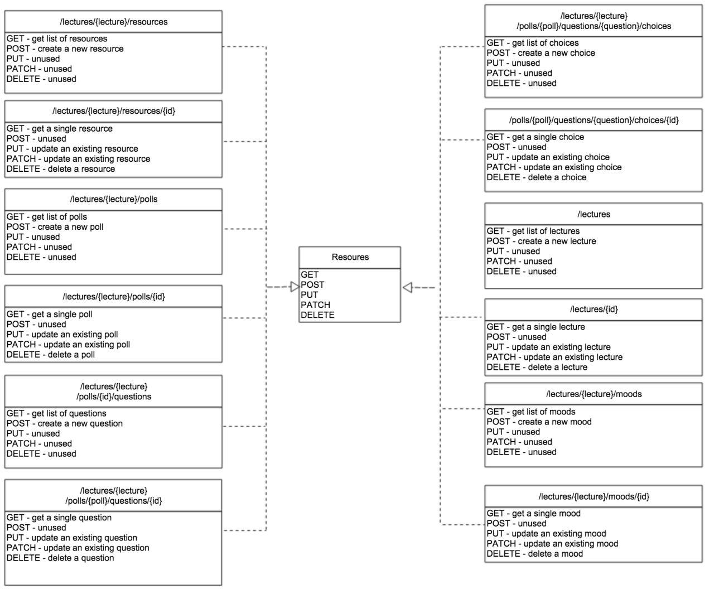

# Project Report

## Administrative information

### Team

Last name, first name | Github ID   | Role                          |
----------------------|-------------|-------------------------------|
D'Agostino, Eléonore  | [paranoodle](https://github.com/paranoodle) | 
Ghozlani, Karim       | [gweezer7](https://github.com/gweezer7)     | 
Kammoun, Yassin       | [yibnl](https://github.com/yibnl)           | 
Ntawuruhunga, Paul    | [paulnta](https://github.com/paulnta)       | 

## Table of Contents
1. [Introduction](#Intro)
1. [User Guide](#Guide)
1. [Design](#Design)
    1. [System overview](#Overview)
    1. [User interface](#Interface)
    1. [Database](#Database) 
    1. [REST API](#RestAPI)
    1. [Design patterns](#Patterns)
1. [Implementation](#Implementation)
    1. [Structure](#Structure)
    1. [Test data generation](#Datagen)
    1. [Selected aspects](#Aspects)
1. [Testing and validation](#Testing)
    1. [Test strategy](#Strategy)
    1. [Tools](#Tools)
    1. [Procedures](#Procedures)
    1. [Results](#Results)
1. [Known issues](#Issues)
1. [Conclusion](#Conclusion)
1. [Appendix A: Auto-evaluation](#AppendixA)

## <a name="Intro"></a> Introduction

The purposes of this project is to develop an **interactive presentations** web application. This report currently covers up to part 1, designing and implementing a REST API using Express.js and MongoDB (with the Mongoose library).

## <a name="Guide"></a> User Guide

### How to execute and access the application

* [poll.iwog web application](http://polliwog-app.herokuapp.com). 
* [poll.iwog REST API](http://polliwog-app.herokuapp.com/api).
* [poll.iwog REST API Documentation](https://github.com/paulnta/Teaching-HEIGVD-TWEB-2015-Project/tree/master/api).
* [poll.iwog product page](http://###). 
* [poll.iwog product specification](https://github.com/paulnta/Teaching-HEIGVD-TWEB-2015-Project/blob/master/specifications/specifications.md).
* [poll.iwog product mockups](https://github.com/paulnta/Teaching-HEIGVD-TWEB-2015-Project/tree/master/specifications/interface%20sketches).

*The REST API Documentation link redirects to a basic markdown description of the API. However, both HTML and RAML version with more content can be found on the same path.*

### How to use the application

The web application is a very simple landing page with a tiny bit of dynamic content fetched via AJAX yet at the moment. Its only feature is to display various statistics. 

## <a name="Design"></a> Design

### <a name="Overview"></a> System overview

Our application is currently able to respond to HTTP requests. It provides a REST API which supports usual CRUD operations through HTTP methods. Complete description of supported actions of the REST API are documented. The documentation can be accessed from the web application's landing page.

### <a name="Interface"></a> User interface


The user interface currently consists of a simple landing page with no options for interactions. Listed on it are some simple statistics about the application usage to date.

### <a name="Database"></a> Database

#### Data model


*Note that the purpose of the different types of stroke is just to make the figure more readable.*

The data model takes a relational database's traditionnal approach in which references are used to establish relations between entities. This has several advantages:

* It simplifies the database design. All document structure issues disappear. One should only wonder about how are associations between entities captured in the payloads. 

* It improves referential integrity. No questions can ever exist without being associated to any poll. The same goes for relations binding the other entities in the data model. This is a guarantee of consistency of the contents of the database .

* It can benefits from Mongoose population mechanism. One can retrieve one document ID or document content by using the **Document#populate** function. Moreover, it would still be possible to propose the alternative URLs to reference a document collection.

On the one hand, the data model takes advantage of the flexibility of document-oriented databases. On the other hand, it enjoys the security provided by referential constraints of relational databases.

#### Documents structure

**Polls**
```javascript
{
    _id: <ObjectId>,
    title: String,
    creationDate: Date,
    state: String,
    questions: [<ObjectId>],
    participations: [<ObjectId>]
}
```

*Example*
```javascript
{
    _id: 345ae2224df,
    title: 'api-copilot-2015',
    creationDate: 2015-11-02 17:00,
    state: 'active',
    questions: [422334578, 2233454, 22357],
    participations: [1225578, 1233548, 58666, 45258]
}
```

**Questions**
```javascript
{
    _id: <ObjectId>,
    poll: <ObjectId>,
    title: String,
    type: String,
    choices: [<ObjectId>]
}
```

*Example*
```javascript
{
    _id: 422334578,
    poll: 345ae2224df,
    title: 'What is a scenario?',
    type: 'reminder',
    choices: [899982, 42257, 12347]
}
```
***

**Choices**
```javascript
{
    _id: <ObjectId>,
    question: <ObjectId>,
    key: String,
    text: String,
    answers: [<ObjectId>]
}
```

*Example*
```javascript
{
    _id: 12347,
    question: 422334578,
    key: 'a',
    text: 'A sequence of steps that you define using the step method.',
    answers: [86655787, 411111, 2350558]
}
```

***

**Participations**
```javascript
{
    _id: <ObjectId>,
    poll: <ObjectId>,
    participant: String,
    submissionDate: Date,
    answers: [<ObjectId>]
}
```

*Example*
```javascript
{
    _id: 1225578,
    poll: 422334578,
    participant: 'yibnl',
    submissionDate: 2015-11-04,
    answers: [1111111, 222222, 325252]
}
```
***

**Answers**
```javascript
{
    _id: <ObjectId>,
    participation: <ObjectId>,
    choice: <ObjectId>
}
```

*Example*
```javascript
{
    _id: 325252,
    participation: 1225578,
    choice: 12347
}
```

#### Data integrity

**Polls**

| Property      | Auto  | Required  | Null  | Default   |
|---------------|:-----:|:---------:|:-----:|:---------:|
| _id           | x     |           |       |           |
| title         |       | x         |       |           |
| creationDate  |       |           |       | now       |
| state*        |       |           |       | drafti    |
| questions     |       |           | x     |           |
| participations|       |           | x     |           |

*state's possible values can be drafti, active and closed.*
***

**Questions**

| Property  | Auto  | Required  | Null  | Default   |
|-----------|:-----:|:---------:|:-----:|:---------:|
| _id       | x     |           |       |           |
| poll      |       |           |       |           |
| title     |       | x         |       |           |
| type      |       |           | x     | empty     |
| choices   |       |           | x     |           |
***

**Choices**

| Property  | Auto  | Required  | Null  | Default   |
|-----------|:-----:|:---------:|:-----:|:---------:|
| _id       | x     |           |       |           |
| question  |       |           |       |           |
| key |     | x     |           |       |           |
| text      |       | x         |       |           |
| answers   |       |           | x     |           |
***

**Participations**

| Property      | Auto  | Required  | Null  | Default   |
|---------------|:-----:|:---------:|:-----:|:---------:|
| _id           | x     |           |       |           |
| poll          |       |           |       |           |
| participant   |       | x         |       |           |
| submissionDate|       |           |       | now       |
| answers       |       |           | x     |           |
***

**Answers**

| Property      | Auto  | Required  | Null  | Default   |
|---------------|:-----:|:---------:|:-----:|:---------:|
| _id           | x     |           |       |           |
| participation |       |           |       |           |
| choice        |       |           |       |           |

#### Referential integrity

Data model and documents structure both show bidirectional associations between entities. This design choice is justified by the fact that it simplifies referential integrity implementation. 

Let's assume that we want to remove a question document. We have to update parent poll's questions list in order to ensure database consistency. Mechanisms of delete on cascade, update on cascade and so on must be set up. This parent poll would have to be found at a given point in time. Storing parent poll's ID avoids querying all polls to find the good one to be updated.

It results from the above that storing parent ID can improve computing perfomance. Of course it is necessary to maintain consistency on both sides in return. That is the price to pay for having a design as easy to implement.

### <a name="RestAPI"></a> REST API

#### Resources

The REST API resources are taken from the data model. Note the following elements:

* A **Poll** can contain several multiple-choice **Questions**. A poll can be in different states: *drafti*, *active* and *closed*.

* For every question, there can be several **Choices**.

* A user can answer questions in a poll. This creates a **Participation** entity.

* A **Participation** contains several **Answers**.

* Every **Answer** is related to one **Question** and one **Choice**.

#### URL Structure

The resources description shows both composition and aggregation relationships between entities. The most appropriate URL structure therefore is alternate collection / resource path segments relative to the API entry point.

| URL                           | Description                                |
|-------------------------------|--------------------------------------------|
| /api                          | The API entry point                        |
| /api/:coll                    | A top-level collection named “coll”        |
| /api/:coll/:id                | The resource “id” inside collection “coll” |
| /api/:coll/:id/:subcol        | Sub-collection “subcol” under resource “id”|
| /api/:coll/:id/:subcol/:subid | The resource “subid” inside “subcol”       |

#### Linked resources

Since every entities reference parent and children entities, payloads returned should be easy to process when invoking URLs. It have to be true on both client and server sides. IDs are used for that purpose in the database. This is the easiest way to handle data requests on the server side. However, it would be unpleasant for any client to be forced to build URLs from IDs in order to submit any HTTP requests. This is why payloads returned provide resources URLs instead for any children references only, not parent references. 

Let's take an example. Assume that we want to retrieve poll #1 data for which questions #2, #3 and #4 have been created. The request would be:

```
GET /.../api/polls/1 HTTP/1.1
...
```

According to what has been said earlier, the response returned should contain URLs to any question related to the given poll. The payload response therefore would look like this:

```
HTTP/1.1 200 OK
Content-Type: application/json

{
    _id: 1,
    title: 'myTitle',
    state: 'drafti',
    questions: [
        '/polls/1/questions/2', 
        '/polls/1/questions/3',
        '/polls/1/questions/4'
    ],
    participations: []
}
```

In the case of a deeper resource like a question, the response would contain a URLs array of choices. However, the parent property value referencing the containing poll would be the poll ID, not a URL. 

```
HTTP/1.1 200 OK
Content-Type: application/json

{
    _id: 2,
    poll: 1,
    title: 'myQuestion',
    type: 'anyType',
    choices: [
        '/polls/1/questions/2/choices/5', 
        '/polls/1/questions/2/choices/6',
        '/polls/1/questions/2/choices/7'
    ]
}
```

#### Resources & actions



The illustration shows common supported CRUD operations according to the resource type:

* In the case of collections, READ and CREATE operations are provided.

* In the case of documents, READ, UPDATE et DELETE operations are provided.

One can also notice the PATCH HTTP method which is supposed to allow partial updates on resources of document type. In the case of the REST API, the behavior is the same as the PUT's one. They share the same update algorithm. Besides, Mongoose library provides merging functions making easy to implement partial updates. This is exactly the way it has been implemented.

It could be found strange to use the PATH HTTP method on some resources. However, this method happens to be very useful when a typo mistake has been made. This is why the REST API makes it available on any document resource.

One of the basic feature the REST API should provide according to the part 1 specification is poll's state change. Neither particular resource nor particular verb is defined to process a such operation. Changing the state of a poll is basically an update. Invoking both PUT and PATCH HTTP methods allows anyone to do so.

Both PUT and PATH HTTP methods can be used to update polls. This means therefore that a simple request can modify the state of the pool, and thus close it. The REST API fully supports this feature. However, closing a poll will have no effect than changing the value of the state property. One client  would still be able to add more questions, another one would be able to answer questions of a closed poll. The current version of the API does not define any rules specifying what operations can be performed when a poll is in a specific state. Furthermore, the specification of the project does not mention anything about this. It would be a task for the next step of the project.

The illustration does not provide any information on the precise way to answer questions. One could submit a POST request to /polls/{poll}/participations/{participation}/answers. This is correct but unsufficient. Query parameters are required in order to specify which **question** a user wants to answer and which **choice** the same user has chosen.

According to the part 1 spectification, answering a question should automatically create a participation. This has not been designed yet. A user entity is probably required to provide a such behavior. 

#### HTTP status code
Errors can occur while processing HTTP requests or while computing HTTP responses. The web application server is likely to return HTTP status code:

* 200 - *It is returned when a GET request or a PUT/PATCH request is submitted and succeed. The requested/updated data is returned as the response payload.* 

* 201 - *It is returned when a POST request is submitted and succeed. The created data is returned as the response payload.* 

* 204 - No Content. *It is returned when a DELETE request is submitted and succeed.*

* 400 - Bad request. *It is returned when required query parameters are missing.*

* 404 - Not found. *It is returned when a GET request is submitted and fails. It is also returned when a POST/PUT/PATCH/DELETE request requires a research and does not find anything.*

* 409 - Conflict. *It is returned when a POST request is submitted and an equivalent resource already exists.*

* 500 - *It is returned when an internal error occured. The raw error description is returned as the payload.*

The web application returns no more information about any occured error than these HTTP status codes. They are enough for the moment but may required improvements for the next parts of the project.

### <a name="Patterns"></a> Design patterns

The web application is built on the Model–view–controller pattern. Models are Mongoose Schemas. Controllers are a combination of Express.js routers and Javascript functions. The view is a basic HTML page fetching dynamic content via AJAX by submitting HTTP requests and retrieving representative models' payloads. It is only web application statistics actually.

## <a name="Implementation"></a> Implementation

### <a name="Structure"></a> Structure

### <a name="Datagen"></a> Test data generation

### <a name="Aspects"></a> Selected aspects

## <a name="Testing"></a> Testing and validation

### <a name="Strategy"></a> Test strategy

The test strategy is summarized by the following order logic steps:

1. Constraints Testing
2. CRUD Testing
3. Story Testing

Each entities i.e. poll, question, choice, participation and choice is submitted to these three types of test starting by the poll entity and ending by the answer entity.

#### Constraints Testing

Constraints testing is applied on each entity. The purpose of constraints testing is to validate Mongoose Schemas. It is basically to verify each property validation rules. It is performed by document creation's attempts using POST HTTP requests.

The state of a poll should be one of the value of the enum {drafti, active, closed} for example.

Properties validation's rules testing follows a well-defined approach:

1. Creating an empty document.
2. Creating a document with missing properties values.
3. Creating a document with invalid properties values.
4. Creating a valid document.

Any entity constraints testing is considered to be successful whenever a valid document has been created.

#### CRUD Testing

CRUD testing is applied on each entity. The purpose of CRUD testing is to validate all HTTP methods supported by the REST API on all resources by submitting very simple requests. It is initiated by base documents creation. 

CRUD testing on questions resource requires to create first one poll at least for example.

After that, the following approach is used to test the current CRUD method being tested:

1. *Creating base documents*.
2. Creating resource tested's documents.
3. Performing HTTP requests according to CRUD method being tested.
4. Logging results.

Note that the HTTP methods are tested individually, meaning they all have their own test file.

#### Story Testing

Both constraints and CRUD testing are lightweight test data. It is more than enough for basic and precise validation testing. It is however too little for massive data testing. 

Story testing is massive data testing. The purpose of this kind of test is to simulate important data traffic between the client and the database. It is mainly to produce an important quantity of each HTTP methods on each REST API resource.

A story should be defined. It must describe a situation of intensive REST API interaction similar to an hour of application use. Of course it is difficult to veriy whether results of computation correspond to expected results. The main interest of such a plan is actually to observe the web application reaction to heavy loading, intensive interaction and behavior over the time.

Story testing requires random data generation, random HTTP requests and random HTTP methods. The goal is to set up undefined workflows.

*A specific tool for this kind of test should be used instead of API Coplilot.*

### <a name="Tools"></a> Tools

#### API Copilot

API Copilot is a Node.js based Javascript module which provides data population scenarios features for testing and validating APIs implementation. It defines the concept of scenario which is a series of steps that are executed in order.

Documentation : https://github.com/AlphaHydrae/api-copilot

### <a name="Procedures"></a> Procedures

#### Constraints Testing

##### Polls

Scenario: Poll Constraints

File: ***poll.constraints.scenario.js***

```
The purpose of this scenario is to test poll constraints validating rules. 
The scenario is divided into a series of steps in which the script attempts to create poll documents. The steps follow this logic:

1. We will try to create an empty poll document.
    -> It should fail and return the 500 status code.
2. We will try to create a poll document with an empty title.
    -> It should fail and return the 500 status code.
3. We will try to create a poll document with an invalid state.
    -> It should fail and return the 500 status code.
4. We will try to create a poll document with a default state.
    -> It should succeed, return the 201 status code and the payload of the created document with a default state.
5. We will try to create a poll document with an active state.
    -> It should succeed, return the 201 status code and the payload of the created document with an active state.
6. We will try to create a poll document with a closed state.
    -> It should succeed, return the 201 status code and the payload of the created document with a closed state.
```

##### Questions

Scenario: Question Constraints

File: ***question.constraints.scenario.js***

```
The purpose of this scenario is to test question constraints validating rules. 
The scenario is divided into a series of steps in which the script attempts to create question documents. The steps follow this logic:

1. We will try to create a base poll document.
    -> It should succeed and return the 201 status code.
2. We will try to create an empty question document.
    -> It should fail and return the 500 status code.
3. We will try to create a question document with an empty title.
    -> It should fail and return the 500 status code.
4. We will try to create a question document with a default type (empty).
    -> It should succeed, return the 201 status code and the payload of the created document with a default type (empty).
5. We will try to create a question document with a custom type (reminder).
    -> It should succeed, return the 201 status code and the payload of the created document with a custom type (reminder).
```

##### Choice

Scenario: Choice Constraints

File: ***choice.constraints.scenario.js***

```
The purpose of this scenario is to test choice constraints validating rules. 
The scenario is divided into a series of steps in which the script attempts to create question documents. The steps follow this logic:

1. We will try to create a base poll document.
    -> It should succeed and return the 201 status code.
2. We will try to create an base question document.
    -> It should succeed and return the 201 status code.
3. We will try to create a empty choice document.
    -> It should fail and return the 500 status code.
4. We will try to create a choice document with an empty key.
    -> It should fail and return the 500 status code.
5. We will try to create a choice document with an empty text.
    -> It should fail and return the 500 status code.
6. We will try to create a valid choice document.
    -> It should succeed, return the 201 status code and the payload of the created document.
```

##### Participations

Scenario: Participation Constraints

File: ***participation.constraints.scenario.js***

```
The purpose of this scenario is to test participation constraints validating rules. 
The scenario is divided into a series of steps in which the script attempts to create question documents. The steps follow this logic:

1. We will try to create a base poll document.
    -> It should succeed and return the 201 status code.
2. We will try to create an empty participation document.
    -> It should fail and return the 500 status code.
3. We will try to create a participation document with an empty participant.
    -> It should fail and return the 500 status code.
4. We will try to create a valid participation document.
    -> It should succeed, return the 201 status code and the payload of the created document.
```

##### Answers

Scenario: Answer Constraints

File: ***answer.constraints.scenario.js***

```
The purpose of this scenario is to test answer constraints validating rules. 
The scenario is divided into a series of steps in which the script attempts to create question documents. The steps follow this logic:

1. We will try to create a base poll document.
    -> It should succeed and return the 201 status code.
2. We will try to create an base participation document.
    -> It should succeed and return the 201 status code.
3. We will try to create an base question document.
    -> It should succeed and return the 201 status code.
4. We will try to create a base choice document.
    -> It should succeed and return the 201 status code.
5. We will try to create an answer document without associated question.
    -> It should fail and return the 500 status code.
6. We will try to create an answer document without associated choice.
    -> It should fail and return the 500 status code.
7. We will try to create a valid answer document.
    -> It should succeed, return the 201 status code and the payload of the created document.
```

#### CRUD Testing

##### Polls

Scenario: Poll CREATE RUD

File: ***poll.create.scenario.js***

```

```

***

Scenario: Poll C READ UD

File: ***poll.read.scenario.js***

```

```

***

Scenario: Poll CR UPDATE D

File: ***poll.update.scenario.js***

```

```

Scenario: Poll CRU DELETE

File: ***Poll.delete.scenario.js***

```

```

##### Questions

Scenario: Answer CREATE RUD

File: ***question.create.scenario.js***

```

```

***

Scenario: Question C READ UD

File: ***question.read.scenario.js***

```

```

***

Scenario: Question CR UPDATE D

File: ***question.update.scenario.js***

```

```

Scenario: Question CRU DELETE

File: ***question.delete.scenario.js***

```

```

##### Participations

Scenario: Participation CREATE RUD

File: ***participation.create.scenario.js***

```

```

***

Scenario: Participation C READ UD

File: ***participation.read.scenario.js***

```

```

***

Scenario: Participation CR UPDATE D

File: ***participation.update.scenario.js***

```

```

Scenario: Participation CRU DELETE

File: ***participation.delete.scenario.js***

```

```

##### Choices

Scenario: Choice CREATE RUD

File: ***choice.create.scenario.js***

```

```

***

Scenario: Choice C READ UD

File: ***choice.read.scenario.js***

```

```

***

Scenario: Choice CR UPDATE D

File: ***choice.update.scenario.js***

```

```

Scenario: Choice CRU DELETE

File: ***choice.delete.scenario.js***

```

```

##### Answers

Scenario: Answer CREATE RUD

File: ***answer.create.scenario.js***

```

```

***

Scenario: Answer C READ UD

File: ***answer.read.scenario.js***

```

```

***

Scenario: Answer CR UPDATE D

File: ***answer.update.scenario.js***

```

```

Scenario: Answer CRU DELETE

File: ***answer.delete.scenario.js***

```

```

### <a name="Results"></a> Results

#### Constraints Testing

##### Polls

Scenario: Poll Constraints

File: ***poll.constraints.scenario.js***

Output
```
[1mPoll Constraints[22m

[1mSTEP 1: create an empty poll[22m
Completed in 39ms

[1mSTEP 2: log response status code from creating empty poll[22m
500
Completed in 1ms

[1mSTEP 3: create a poll with an empty title[22m
Completed in 18ms

[1mSTEP 4: log response status code from creating poll with empty title[22m
500
Completed in 0ms

[1mSTEP 5: create a poll with an invalid state[22m
Completed in 8ms

[1mSTEP 6: log response status code[22m
500
Completed in 0ms

[1mSTEP 7: create a poll with a default state[22m
Completed in 8ms

[1mSTEP 8: log created poll with a default state[22m
201
{ __v: 0,
  title: 'my drafti poll',
  _id: '563627c37bc8e0000748fb73',
  participations: [],
  questions: [],
  state: 'drafti',
  creationDate: '2015-11-01T14:54:59.665Z' }
Completed in 3ms

[1mSTEP 9: create a poll with an active state[22m
Completed in 10ms

[1mSTEP 10: log created poll with an active state[22m
201
{ __v: 0,
  title: 'my active poll',
  _id: '563627c37bc8e0000748fb74',
  participations: [],
  questions: [],
  state: 'active',
  creationDate: '2015-11-01T14:54:59.677Z' }
Completed in 1ms

[1mSTEP 11: create a poll with a closed state[22m
Completed in 9ms

[1mSTEP 12: log created poll with a closed state[22m
201
{ __v: 0,
  title: 'my closed poll',
  _id: '563627c37bc8e0000748fb75',
  participations: [],
  questions: [],
  state: 'closed',
  creationDate: '2015-11-01T14:54:59.688Z' }
Completed in 1ms

[32mDONE in 0.10s![39m
```

##### Questions

Scenario: Question Constraints

File: ***question.constraints.scenario.js***

Output
```
[1mQuestion Constraints[22m

[1mSTEP 1: create a poll[22m
Completed in 722ms

[1mSTEP 2: log created poll[22m
201
{ __v: 0,
  title: 'api-copilot',
  _id: '5636373d092d316c11a4b32b',
  participations: [],
  questions: [],
  state: 'drafti',
  creationDate: '2015-11-01T16:01:01.682Z' }
Completed in 4ms

[1mSTEP 3: create an empty question[22m
Completed in 15ms

[1mSTEP 4: log response when creating an empty question[22m
500
Completed in 1ms

[1mSTEP 5: create a question with an empty title[22m
Completed in 8ms

[1mSTEP 6: log response when creating an question with an empty title[22m
500
Completed in 0ms

[1mSTEP 7: create a valid question with default type[22m
Completed in 12ms

[1mSTEP 8: log created question with default type[22m
201
{ __v: 0,
  title: 'What is api-copilot ?',
  poll: '5636373d092d316c11a4b32b',
  _id: '5636373e092d316c11a4b32e',
  choices: [],
  type: '' }
Completed in 1ms

[1mSTEP 9: create a valid question with custom type[22m
Completed in 16ms

[1mSTEP 10: log created question with custom type[22m
201
{ __v: 0,
  title: 'What is a scenario ?',
  poll: '5636373d092d316c11a4b32b',
  _id: '5636373e092d316c11a4b32f',
  choices: [],
  type: 'reminder' }
Completed in 1ms

[32mDONE in 0.78s![39m
```

##### Choice

Scenario: Choice Constraints

File: ***choice.constraints.scenario.js***

Output
```
[1mQuestion Constraints[22m

[1mSTEP 1: create a poll[22m
Completed in 722ms

[1mSTEP 2: log created poll[22m
201
{ __v: 0,
  title: 'api-copilot',
  _id: '5636373d092d316c11a4b32b',
  participations: [],
  questions: [],
  state: 'drafti',
  creationDate: '2015-11-01T16:01:01.682Z' }
Completed in 4ms

[1mSTEP 3: create an empty question[22m
Completed in 15ms

[1mSTEP 4: log response when creating an empty question[22m
500
Completed in 1ms

[1mSTEP 5: create a question with an empty title[22m
Completed in 8ms

[1mSTEP 6: log response when creating an question with an empty title[22m
500
Completed in 0ms

[1mSTEP 7: create a valid question with default type[22m
Completed in 12ms

[1mSTEP 8: log created question with default type[22m
201
{ __v: 0,
  title: 'What is api-copilot ?',
  poll: '5636373d092d316c11a4b32b',
  _id: '5636373e092d316c11a4b32e',
  choices: [],
  type: '' }
Completed in 1ms

[1mSTEP 9: create a valid question with custom type[22m
Completed in 16ms

[1mSTEP 10: log created question with custom type[22m
201
{ __v: 0,
  title: 'What is a scenario ?',
  poll: '5636373d092d316c11a4b32b',
  _id: '5636373e092d316c11a4b32f',
  choices: [],
  type: 'reminder' }
Completed in 1ms

[32mDONE in 0.78s![39m
```

##### Participations

Scenario: Participation Constraints

File: ***participation.constraints.scenario.js***

Output
```
[1mParticipation Constraints[22m

[1mSTEP 1: create a poll[22m
Completed in 399ms

[1mSTEP 2: log created poll[22m
201
{ __v: 0,
  title: 'api-copilot',
  _id: '56363e64092d316c11a4b33a',
  participations: [],
  questions: [],
  state: 'drafti',
  creationDate: '2015-11-01T16:31:32.820Z' }
Completed in 5ms

[1mSTEP 3: create an empty participation[22m
Completed in 20ms

[1mSTEP 4: log response when creating an empty participation[22m
500
Completed in 1ms

[1mSTEP 5: create a participation with an empty participant[22m
Completed in 12ms

[1mSTEP 6: log response when creating a participation with an empty participant[22m
500
Completed in 1ms

[1mSTEP 7: create a valid participation[22m
Completed in 9ms

[1mSTEP 8: log created participation[22m
201
{ __v: 0,
  participant: 'yibnl',
  poll: '56363e64092d316c11a4b33a',
  _id: '56363e65092d316c11a4b33d',
  answers: [],
  submissionDate: '2015-11-01T16:31:33.237Z' }
Completed in 1ms

[32mDONE in 0.45s![39m
```

##### Answers

Scenario: Answer Constraints

File: ***answer.constraints.scenario.js***

Output
```
[1mAnswer Constraints[22m

[1mSTEP 1: create a poll[22m
Completed in 393ms

[1mSTEP 2: log created poll[22m
201
{ __v: 0,
  title: 'api-copilot',
  _id: '56364218092d316c11a4b343',
  participations: [],
  questions: [],
  state: 'drafti',
  creationDate: '2015-11-01T16:47:20.040Z' }
Completed in 7ms

[1mSTEP 3: create a valid participation[22m
Completed in 21ms

[1mSTEP 4: log created participation[22m
201
{ __v: 0,
  participant: 'yibnl',
  poll: '56364218092d316c11a4b343',
  _id: '56364218092d316c11a4b344',
  answers: [],
  submissionDate: '2015-11-01T16:47:20.426Z' }
Completed in 0ms

[1mSTEP 5: create a question[22m
Completed in 11ms

[1mSTEP 6: log created question[22m
201
{ __v: 0,
  title: 'What is a scenario ?',
  poll: '56364218092d316c11a4b343',
  _id: '56364218092d316c11a4b345',
  choices: [],
  type: 'reminder' }
Completed in 1ms

[1mSTEP 7: create a choice[22m
Completed in 16ms

[1mSTEP 8: log created choice[22m
201
{ __v: 0,
  key: 'a',
  text: 'A scenario is a series of steps that are executed in order.',
  question: '56364218092d316c11a4b345',
  _id: '56364218092d316c11a4b346',
  answers: [] }
Completed in 2ms

[1mSTEP 9: create an answer without associated question[22m
Completed in 9ms

[1mSTEP 10: log response status code returned since question is missing[22m
400
Completed in 0ms

[1mSTEP 11: create an answer without associated choice[22m
Completed in 7ms

[1mSTEP 12: log response status code returned since choice is missing[22m
400
Completed in 1ms

[1mSTEP 13: create an answer[22m
Completed in 16ms

[1mSTEP 14: log created answer[22m
201
{ __v: 0,
  participation: '56364218092d316c11a4b344',
  choice: '56364218092d316c11a4b346',
  _id: '56364218092d316c11a4b347' }
Completed in 1ms

[32mDONE in 0.49s![39m
```

#### CRUD Testing

##### Polls

Scenario: Poll CREATE RUD

File: ***poll.create.scenario.js***

Output
```

```

***

Scenario: Poll C READ UD

File: ***poll.read.scenario.js***

Output
```

```

***

Scenario: Poll CR UPDATE D

File: ***poll.update.scenario.js***

Output
```

```

Scenario: Poll CRU DELETE

File: ***Poll.delete.scenario.js***

Output
```

```

##### Questions

Scenario: Answer CREATE RUD

File: ***question.create.scenario.js***

Output
```

```

***

Scenario: Question C READ UD

File: ***question.read.scenario.js***

Output
```

```

***

Scenario: Question CR UPDATE D

File: ***question.update.scenario.js***

Output
```

```

Scenario: Question CRU DELETE

File: ***question.delete.scenario.js***

Output
```

```

##### Participations

Scenario: Participation CREATE RUD

File: ***participation.create.scenario.js***

Output
```

```

***

Scenario: Participation C READ UD

File: ***participation.read.scenario.js***

Output
```

```

***

Scenario: Participation CR UPDATE D

File: ***participation.update.scenario.js***

Output
```

```

Scenario: Participation CRU DELETE

File: ***participation.delete.scenario.js***

Output
```

```

##### Choices

Scenario: Choice CREATE RUD

File: ***choice.create.scenario.js***

Output
```
[1mChoice CREATE RUD[22m

[1mSTEP 1: create a poll[22m
Completed in 582ms

[1mSTEP 2: log created poll[22m
201
{ __v: 0,
  title: 'api-copilot',
  _id: '563646c3092d316c11a4b352',
  participations: [],
  questions: [],
  state: 'drafti',
  creationDate: '2015-11-01T17:07:15.851Z' }
Completed in 4ms

[1mSTEP 3: create a question[22m
Completed in 32ms

[1mSTEP 4: log created question[22m
201
{ __v: 0,
  title: 'What is a scenario ?',
  poll: '563646c3092d316c11a4b352',
  _id: '563646c4092d316c11a4b353',
  choices: [],
  type: 'reminder' }
Completed in 0ms

[1mSTEP 5: create choices[22m
Completed in 33ms

[1mSTEP 6: log created choices[22m
201
201
201
3 choices created:
{ __v: 0,
  key: 'c',
  text: 'A written outline of a film, novel, or stage work giving details of the plot and individual scenes.',
  question: '563646c4092d316c11a4b353',
  _id: '563646c4092d316c11a4b354',
  answers: [] }
{ __v: 0,
  key: 'b',
  text: 'A series of steps that are executed in order using the "step" method.',
  question: '563646c4092d316c11a4b353',
  _id: '563646c4092d316c11a4b355',
  answers: [] }
{ __v: 0,
  key: 'a',
  text: 'A setting, in particular for a work of art or literature.',
  question: '563646c4092d316c11a4b353',
  _id: '563646c4092d316c11a4b356',
  answers: [] }
Completed in 2ms

[32mDONE in 0.66s![39m
```

***

Scenario: Choice C READ UD

File: ***choice.read.scenario.js***

Output
```
[1mChoice C READ UD[22m

[1mSTEP 1: create a poll[22m
Completed in 404ms

[1mSTEP 2: log created poll[22m
201
{ __v: 0,
  title: 'api-copilot',
  _id: '56364785092d316c11a4b35c',
  participations: [],
  questions: [],
  state: 'drafti',
  creationDate: '2015-11-01T17:10:29.966Z' }
Completed in 3ms

[1mSTEP 3: create a question[22m
Completed in 17ms

[1mSTEP 4: log created question[22m
201
{ __v: 0,
  title: 'What is a scenario ?',
  poll: '56364785092d316c11a4b35c',
  _id: '56364786092d316c11a4b35d',
  choices: [],
  type: 'reminder' }
Completed in 0ms

[1mSTEP 5: create choices[22m
Completed in 31ms

[1mSTEP 6: log created choices[22m
201
201
201
3 choices created:
{ __v: 0,
  key: 'c',
  text: 'A written outline of a film, novel, or stage work giving details of the plot and individual scenes.',
  question: '56364786092d316c11a4b35d',
  _id: '56364786092d316c11a4b35e',
  answers: [] }
{ __v: 0,
  key: 'b',
  text: 'A series of steps that are executed in order using the "step" method.',
  question: '56364786092d316c11a4b35d',
  _id: '56364786092d316c11a4b35f',
  answers: [] }
{ __v: 0,
  key: 'a',
  text: 'A setting, in particular for a work of art or literature.',
  question: '56364786092d316c11a4b35d',
  _id: '56364786092d316c11a4b360',
  answers: [] }
Completed in 3ms

[1mSTEP 7: read all choices[22m
Completed in 12ms

[1mSTEP 8: log all read choices[22m
200
3 choices read:
[ { _id: '56364786092d316c11a4b35e',
    key: 'c',
    text: 'A written outline of a film, novel, or stage work giving details of the plot and individual scenes.',
    question: '56364786092d316c11a4b35d',
    __v: 0,
    answers: [] },
  { _id: '56364786092d316c11a4b35f',
    key: 'b',
    text: 'A series of steps that are executed in order using the "step" method.',
    question: '56364786092d316c11a4b35d',
    __v: 0,
    answers: [] },
  { _id: '56364786092d316c11a4b360',
    key: 'a',
    text: 'A setting, in particular for a work of art or literature.',
    question: '56364786092d316c11a4b35d',
    __v: 0,
    answers: [] } ]
Completed in 2ms

[1mSTEP 9: read choices[22m
Completed in 24ms

[1mSTEP 10: log read choices[22m
3 choices read:
200
{ _id: '56364786092d316c11a4b360',
  key: 'a',
  text: 'A setting, in particular for a work of art or literature.',
  question: '56364786092d316c11a4b35d',
  __v: 0,
  answers: [] }
200
{ _id: '56364786092d316c11a4b35f',
  key: 'b',
  text: 'A series of steps that are executed in order using the "step" method.',
  question: '56364786092d316c11a4b35d',
  __v: 0,
  answers: [] }
200
{ _id: '56364786092d316c11a4b35e',
  key: 'c',
  text: 'A written outline of a film, novel, or stage work giving details of the plot and individual scenes.',
  question: '56364786092d316c11a4b35d',
  __v: 0,
  answers: [] }
Completed in 2ms

[32mDONE in 0.50s![39m
```

***

Scenario: Choice CR UPDATE D

File: ***choice.update.scenario.js***

Output
```
[1mChoice CR UPDATE D[22m

[1mSTEP 1: create a poll[22m
Completed in 408ms

[1mSTEP 2: log created poll[22m
201
{ __v: 0,
  title: 'api-copilot',
  _id: '5636480a092d316c11a4b366',
  participations: [],
  questions: [],
  state: 'drafti',
  creationDate: '2015-11-01T17:12:42.325Z' }
Completed in 5ms

[1mSTEP 3: create a question[22m
Completed in 21ms

[1mSTEP 4: log created question[22m
201
{ __v: 0,
  title: 'What is a scenario ?',
  poll: '5636480a092d316c11a4b366',
  _id: '5636480a092d316c11a4b367',
  choices: [],
  type: 'reminder' }
Completed in 1ms

[1mSTEP 5: create choices[22m
Completed in 27ms

[1mSTEP 6: log created choices[22m
201
201
201
3 choices created:
{ __v: 0,
  key: 'c',
  text: 'A written outline of a film, novel, or stage work giving details of the plot and individual scenes.',
  question: '5636480a092d316c11a4b367',
  _id: '5636480a092d316c11a4b368',
  answers: [] }
{ __v: 0,
  key: 'b',
  text: 'A series of steps that are executed in order using the "step" method.',
  question: '5636480a092d316c11a4b367',
  _id: '5636480a092d316c11a4b369',
  answers: [] }
{ __v: 0,
  key: 'a',
  text: 'A setting, in particular for a work of art or literature.',
  question: '5636480a092d316c11a4b367',
  _id: '5636480a092d316c11a4b36a',
  answers: [] }
Completed in 2ms

[1mSTEP 7: update choices[22m
Completed in 27ms

[1mSTEP 8: log updated choices[22m
200
200
200
3 choices updated:
{ _id: '5636480a092d316c11a4b36a',
  key: '3',
  text: 'A setting, in particular for a work of art or literature.',
  question: '5636480a092d316c11a4b367',
  __v: 0,
  answers: [] }
{ _id: '5636480a092d316c11a4b369',
  key: '2',
  text: 'A series of steps that are executed in order using the "step" method.',
  question: '5636480a092d316c11a4b367',
  __v: 0,
  answers: [] }
{ _id: '5636480a092d316c11a4b368',
  key: '1',
  text: 'A written outline of a film, novel, or stage work giving details of the plot and individual scenes.',
  question: '5636480a092d316c11a4b367',
  __v: 0,
  answers: [] }
Completed in 2ms

[32mDONE in 0.49s![39m
```

Scenario: Choice CRU DELETE

File: ***choice.delete.scenario.js***

Output
```
[1mChoice CRU DELETE[22m

[1mSTEP 1: create a poll[22m
Completed in 449ms

[1mSTEP 2: log created poll[22m
201
{ __v: 0,
  title: 'api-copilot',
  _id: '56364882092d316c11a4b370',
  participations: [],
  questions: [],
  state: 'drafti',
  creationDate: '2015-11-01T17:14:42.434Z' }
Completed in 3ms

[1mSTEP 3: create a question[22m
Completed in 17ms

[1mSTEP 4: log created question[22m
201
{ __v: 0,
  title: 'What is a scenario ?',
  poll: '56364882092d316c11a4b370',
  _id: '56364882092d316c11a4b371',
  choices: [],
  type: 'reminder' }
Completed in 1ms

[1mSTEP 5: create choices[22m
Completed in 28ms

[1mSTEP 6: log created choices[22m
201
201
201
3 choices created:
{ __v: 0,
  key: 'c',
  text: 'A written outline of a film, novel, or stage work giving details of the plot and individual scenes.',
  question: '56364882092d316c11a4b371',
  _id: '56364882092d316c11a4b372',
  answers: [] }
{ __v: 0,
  key: 'b',
  text: 'A series of steps that are executed in order using the "step" method.',
  question: '56364882092d316c11a4b371',
  _id: '56364882092d316c11a4b373',
  answers: [] }
{ __v: 0,
  key: 'a',
  text: 'A setting, in particular for a work of art or literature.',
  question: '56364882092d316c11a4b371',
  _id: '56364882092d316c11a4b374',
  answers: [] }
Completed in 2ms

[1mSTEP 7: delete choices[22m
Completed in 37ms

[1mSTEP 8: log deleted polls responses[22m
3 choices deleted:
204
No Content
204
No Content
204
No Content
Completed in 0ms

[32mDONE in 0.54s![39m
```

##### Answers

Scenario: Answer CREATE RUD

File: ***answer.create.scenario.js***

Output
```
[1mChoice CRU DELETE[22m

[1mSTEP 1: create a poll[22m
Completed in 441ms

[1mSTEP 2: log created poll[22m
201
{ __v: 0,
  title: 'api-copilot',
  _id: '563649a2092d316c11a4b37c',
  participations: [],
  questions: [],
  state: 'drafti',
  creationDate: '2015-11-01T17:19:30.267Z' }
Completed in 6ms

[1mSTEP 3: create a question[22m
Completed in 25ms

[1mSTEP 4: log created question[22m
201
{ __v: 0,
  title: 'What is a scenario ?',
  poll: '563649a2092d316c11a4b37c',
  _id: '563649a2092d316c11a4b37d',
  choices: [],
  type: 'reminder' }
Completed in 1ms

[1mSTEP 5: create choices[22m
Completed in 27ms

[1mSTEP 6: log created choices[22m
201
201
201
3 choices created:
{ __v: 0,
  key: 'c',
  text: 'A written outline of a film, novel, or stage work giving details of the plot and individual scenes.',
  question: '563649a2092d316c11a4b37d',
  _id: '563649a2092d316c11a4b37e',
  answers: [] }
{ __v: 0,
  key: 'b',
  text: 'A series of steps that are executed in order using the "step" method.',
  question: '563649a2092d316c11a4b37d',
  _id: '563649a2092d316c11a4b37f',
  answers: [] }
{ __v: 0,
  key: 'a',
  text: 'A setting, in particular for a work of art or literature.',
  question: '563649a2092d316c11a4b37d',
  _id: '563649a2092d316c11a4b380',
  answers: [] }
Completed in 3ms

[1mSTEP 7: delete choices[22m
Completed in 29ms

[1mSTEP 8: log deleted polls responses[22m
3 choices deleted:
204
No Content
204
No Content
204
No Content
Completed in 1ms

[32mDONE in 0.54s![39m
```

***

Scenario: Answer C READ UD

File: ***answer.read.scenario.js***

Output
```
[1mAnswer C READ UD[22m

[1mSTEP 1: create a poll[22m
Completed in 432ms

[1mSTEP 2: log created poll[22m
201
{ __v: 0,
  title: 'api-copilot',
  _id: '56364a2f092d316c11a4b38d',
  participations: [],
  questions: [],
  state: 'drafti',
  creationDate: '2015-11-01T17:21:51.484Z' }
Completed in 4ms

[1mSTEP 3: create a participation[22m
Completed in 16ms

[1mSTEP 4: log created participation[22m
201
{ __v: 0,
  participant: 'yibnl',
  poll: '56364a2f092d316c11a4b38d',
  _id: '56364a2f092d316c11a4b38e',
  answers: [],
  submissionDate: '2015-11-01T17:21:51.904Z' }
Completed in 1ms

[1mSTEP 5: create questions[22m
Completed in 27ms

[1mSTEP 6: log created questions[22m
201
201
2 questions created:
{ __v: 0,
  title: 'How do you run a scenario ?',
  poll: '56364a2f092d316c11a4b38d',
  _id: '56364a2f092d316c11a4b38f',
  choices: [],
  type: 'reminder' }
{ __v: 0,
  title: 'What is a scenario ?',
  poll: '56364a2f092d316c11a4b38d',
  _id: '56364a2f092d316c11a4b390',
  choices: [],
  type: 'reminder' }
Completed in 2ms

[1mSTEP 7: create choices[22m
Completed in 53ms

[1mSTEP 8: log created choices[22m
201
201
201
201
201
201
6 choices created:
{ __v: 0,
  key: 'c',
  text: 'None of these',
  question: '56364a2f092d316c11a4b390',
  _id: '56364a2f092d316c11a4b391',
  answers: [] }
{ __v: 0,
  key: 'b',
  text: 'api-copilot [scenario]',
  question: '56364a2f092d316c11a4b390',
  _id: '56364a2f092d316c11a4b392',
  answers: [] }
{ __v: 0,
  key: 'a',
  text: 'api-copilot run [scenario]',
  question: '56364a2f092d316c11a4b390',
  _id: '56364a2f092d316c11a4b393',
  answers: [] }
{ __v: 0,
  key: 'c',
  text: 'A written outline of a film, novel, or stage work giving details of the plot and individual scenes.',
  question: '56364a2f092d316c11a4b38f',
  _id: '56364a2f092d316c11a4b394',
  answers: [] }
{ __v: 0,
  key: 'b',
  text: 'A series of steps that are executed in order using the "step" method.',
  question: '56364a2f092d316c11a4b38f',
  _id: '56364a2f092d316c11a4b395',
  answers: [] }
{ __v: 0,
  key: 'a',
  text: 'A setting, in particular for a work of art or literature.',
  question: '56364a2f092d316c11a4b38f',
  _id: '56364a2f092d316c11a4b396',
  answers: [] }
Completed in 2ms

[1mSTEP 9: create answers[22m
Completed in 24ms

[1mSTEP 10: log created answers[22m
201
201
2 answers created:
{ __v: 0,
  participation: '56364a2f092d316c11a4b38e',
  choice: '56364a2f092d316c11a4b395',
  _id: '56364a30092d316c11a4b397' }
{ __v: 0,
  participation: '56364a2f092d316c11a4b38e',
  choice: '56364a2f092d316c11a4b392',
  _id: '56364a30092d316c11a4b398' }
Completed in 2ms

[1mSTEP 11: read all answers[22m
Completed in 11ms

[1mSTEP 12: log all read answers[22m
200
2 answer read:
[ { _id: '56364a30092d316c11a4b397',
    participation: '56364a2f092d316c11a4b38e',
    choice: '56364a2f092d316c11a4b395',
    __v: 0 },
  { _id: '56364a30092d316c11a4b398',
    participation: '56364a2f092d316c11a4b38e',
    choice: '56364a2f092d316c11a4b392',
    __v: 0 } ]
Completed in 2ms

[1mSTEP 13: read answer[22m
Completed in 9ms

[1mSTEP 14: log read answer[22m
200
{ _id: '56364a30092d316c11a4b397',
  participation: '56364a2f092d316c11a4b38e',
  choice: '56364a2f092d316c11a4b395',
  __v: 0 }
Completed in 1ms

[32mDONE in 0.59s![39m
```

***

Scenario: Answer CR UPDATE D

File: ***answer.update.scenario.js***

Output
```
[1mAnswer CR UPDATE D[22m

[1mSTEP 1: create a poll[22m
Completed in 394ms

[1mSTEP 2: log created poll[22m
201
{ __v: 0,
  title: 'api-copilot',
  _id: '56364a97092d316c11a4b399',
  participations: [],
  questions: [],
  state: 'drafti',
  creationDate: '2015-11-01T17:23:35.157Z' }
Completed in 3ms

[1mSTEP 3: create a participation[22m
Completed in 15ms

[1mSTEP 4: log created participation[22m
201
{ __v: 0,
  participant: 'yibnl',
  poll: '56364a97092d316c11a4b399',
  _id: '56364a97092d316c11a4b39a',
  answers: [],
  submissionDate: '2015-11-01T17:23:35.538Z' }
Completed in 1ms

[1mSTEP 5: create a question[22m
Completed in 10ms

[1mSTEP 6: log created question[22m
201
{ __v: 0,
  title: 'What is a scenario ?',
  poll: '56364a97092d316c11a4b399',
  _id: '56364a97092d316c11a4b39b',
  choices: [],
  type: 'reminder' }
Completed in 1ms

[1mSTEP 7: create choices[22m
Completed in 28ms

[1mSTEP 8: log created choices[22m
201
201
201
3 choices created:
{ __v: 0,
  key: 'c',
  text: 'A written outline of a film, novel, or stage work giving details of the plot and individual scenes.',
  question: '56364a97092d316c11a4b39b',
  _id: '56364a97092d316c11a4b39c',
  answers: [] }
{ __v: 0,
  key: 'b',
  text: 'A series of steps that are executed in order using the "step" method.',
  question: '56364a97092d316c11a4b39b',
  _id: '56364a97092d316c11a4b39d',
  answers: [] }
{ __v: 0,
  key: 'a',
  text: 'A setting, in particular for a work of art or literature.',
  question: '56364a97092d316c11a4b39b',
  _id: '56364a97092d316c11a4b39e',
  answers: [] }
Completed in 4ms

[1mSTEP 9: create an answer[22m
Completed in 13ms

[1mSTEP 10: log created answer[22m
201
{ __v: 0,
  participation: '56364a97092d316c11a4b39a',
  choice: '56364a97092d316c11a4b39c',
  _id: '56364a97092d316c11a4b39f' }
Completed in 1ms

[1mSTEP 11: update an answer[22m
Completed in 15ms

[1mSTEP 12: log update answer[22m
200
{ _id: '56364a97092d316c11a4b39f',
  participation: '56364a97092d316c11a4b39a',
  choice: '56364a97092d316c11a4b39d',
  __v: 0 }
Completed in 1ms

[32mDONE in 0.49s![39m
```

Scenario: Answer CRU DELETE

File: ***answer.delete.scenario.js***

Output
```
[1mAnswer CRU DELETE[22m

[1mSTEP 1: create a poll[22m
Completed in 370ms

[1mSTEP 2: log created poll[22m
201
{ __v: 0,
  title: 'api-copilot',
  _id: '56364b83092d316c11a4b3a7',
  participations: [],
  questions: [],
  state: 'drafti',
  creationDate: '2015-11-01T17:27:31.606Z' }
Completed in 4ms

[1mSTEP 3: create a participation[22m
Completed in 23ms

[1mSTEP 4: log created participation[22m
201
{ __v: 0,
  participant: 'yibnl',
  poll: '56364b83092d316c11a4b3a7',
  _id: '56364b83092d316c11a4b3a8',
  answers: [],
  submissionDate: '2015-11-01T17:27:31.962Z' }
Completed in 1ms

[1mSTEP 5: create a question[22m
Completed in 14ms

[1mSTEP 6: log created question[22m
201
{ __v: 0,
  title: 'What is a scenario ?',
  poll: '56364b83092d316c11a4b3a7',
  _id: '56364b83092d316c11a4b3a9',
  choices: [],
  type: 'reminder' }
Completed in 1ms

[1mSTEP 7: create choices[22m
Completed in 31ms

[1mSTEP 8: log created choices[22m
201
201
201
3 choices created:
{ __v: 0,
  key: 'c',
  text: 'A written outline of a film, novel, or stage work giving details of the plot and individual scenes.',
  question: '56364b83092d316c11a4b3a9',
  _id: '56364b84092d316c11a4b3aa',
  answers: [] }
{ __v: 0,
  key: 'b',
  text: 'A series of steps that are executed in order using the "step" method.',
  question: '56364b83092d316c11a4b3a9',
  _id: '56364b84092d316c11a4b3ab',
  answers: [] }
{ __v: 0,
  key: 'a',
  text: 'A setting, in particular for a work of art or literature.',
  question: '56364b83092d316c11a4b3a9',
  _id: '56364b84092d316c11a4b3ac',
  answers: [] }
Completed in 3ms

[1mSTEP 9: create an answer[22m
Completed in 13ms

[1mSTEP 10: log created answer[22m
201
{ __v: 0,
  participation: '56364b83092d316c11a4b3a8',
  choice: '56364b84092d316c11a4b3aa',
  _id: '56364b84092d316c11a4b3ad' }
Completed in 1ms

[1mSTEP 11: delete answer[22m
Completed in 11ms

[1mSTEP 12: log deleted answer[22m
204
No Content
Completed in 1ms

[32mDONE in 0.47s
