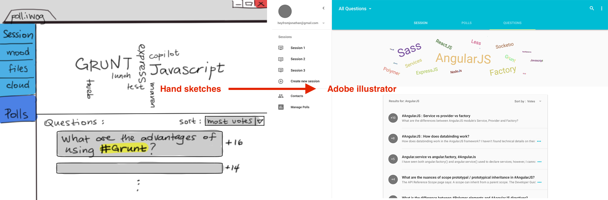
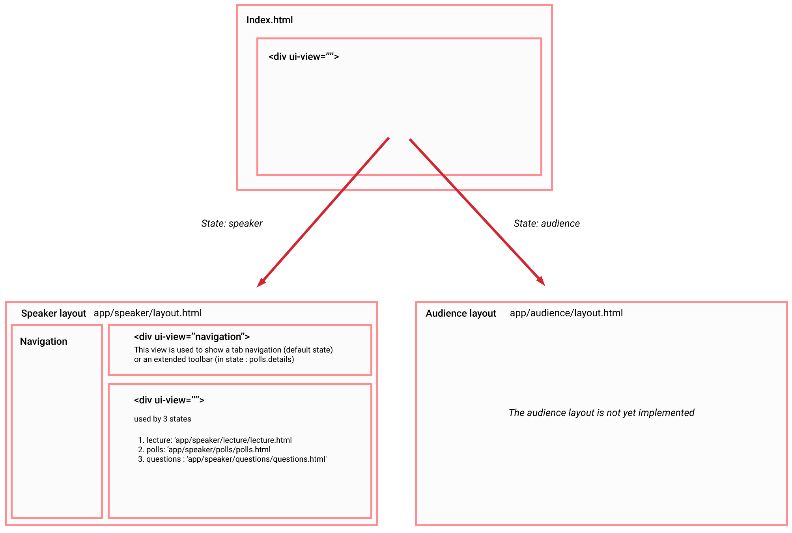
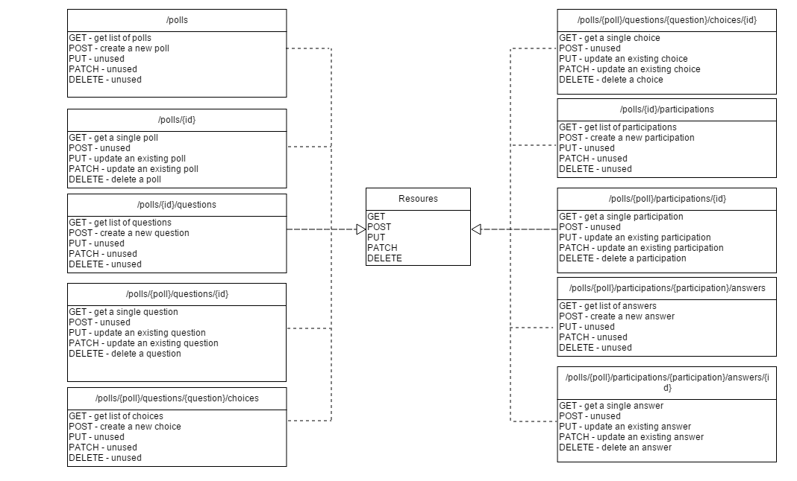
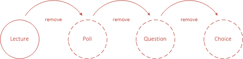
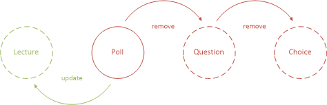
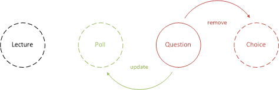
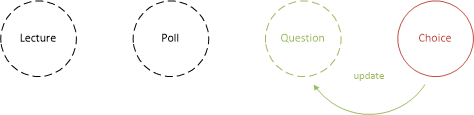

# Phase 2 Project Report

Welcome to the report of the TWEB Project phase 2. This is where you will find information about specification, what has been implemented during the second phase, known issues and what needs to be implemented in the last part of the project.

## Administrative information

### Team

Last name, first name | Github ID                                   |
----------------------|---------------------------------------------|
d'Agostino, Eléonore  | [paranoodle](https://github.com/paranoodle) | 
Ghozlani, Karim       | [gweezer7](https://github.com/gweezer7)     | 
Kammoun, Yassin       | [yibnl](https://github.com/yibnl)           | 
Ntawuruhunga, Paul    | [paulnta](https://github.com/paulnta)       | 

### Links

* [Polliwog web application](http://polliwog-app.herokuapp.com).
* [Polliwog REST API](http://polliwog-app.herokuapp.com/api).
* [Polliwog REST API Documentation](https://github.com/paulnta/Teaching-HEIGVD-TWEB-2015-Project/tree/master/api).
* [Polliwog product page](http://paulnta.github.io/Teaching-HEIGVD-TWEB-2015-Project/).

> The REST API Documentation link redirects to a basic markdown description of the API. However, both HTML and RAML version with more content can be found on the same location.

## Table of Contents
1. [Introduction](#Intro)
1. [Specification](#Spec)
1. [Tools](#Tools)
1. [Client](#Client)
	 1. [User Interfaces](#UI)
	 1. [Project Structure](#Structure) 
	 1. [State Pattern](#State)
1. [Server](#Server)
    1. [REST API](#API)
    1. [REST API Documentation](#APIDoc)
1. [Remaining Work](#Work)
1. [Known issues](#Issues)
1. [Conclusion](#Conclusion)

## <a name="Intro"></a> Introduction

The purpose of this report is to describe what has been implemented during the second phase of the project.

## <a name="Spec"></a> Specifications

First, a short summary of the features we had planned to implement for part 2:

* User accounts (optional for listeners, required for speakers)
* Lectures, allowing for the sharing of resources, creating polls, and viewing the current mood of the audience
	* They can be public and only require a key to join
	* Or they can be private and require an account and an invitation
* Polls, consisting of one or more multiple-choice questions
	* Users can answer polls while they are active
	* Poll results can be displayed at the speaker's discretion
* Mood, a measure of the overall satisfaction of the audience

From the [original specifications](https://github.com/paulnta/Teaching-HEIGVD-TWEB-2015-Project/blob/master/specifications/specifications.md), we dropped the TweetQuestions feature from part 2 with the intent to implement it in part 3 instead.

Client-wise, we wanted an interface that was clean and simple to use, and that included at least the following functionalities:

* Logging in to an account as a speaker, and:
	* Creating, editing and deleting lectures, and setting them as active or non
	* Creating, editing and deleting polls (and by extension, questions and choices), setting them as active or non, and viewing their results
	* Accessing the audience's current mood, as a graph
	* Creating and deleting resources to share
* Accessing the site as a listener, with or without an account, and:
	* Accessing a lecture, both via key and invitation
	* Accessing the current lecture's resources
	* Responding to polls when available
	* Inputting a current mood

## <a name="Tools"></a> Tools

* [Angular Fullstack](https://github.com/angular-fullstack/generator-angular-fullstack), for project scaffolding.
* [Angular Material](https://material.angularjs.org), as material design.
* [RAML 8.0](http://raml.org/), for REST API documentation.

## <a name="Client"></a> Client

### <a name="UI"></a> User Interfaces

We started our project by doing the user interface specification. We've sketched the ui and then designed it using Adobe Illustrator. 

We used Invision to share our ideas in order to implement the UI in HTML/CSS/JS with exactly the same idea in mind.

Implementing the UI was one of the hardest part because our goal is to have an Adaptive UI. So we had to deal with many browser compabtibily issues and css media-queries to get a responsive design. We've tested the UI on Chrome for mobile and desktop, Mozilla Firefox for mobile and desktop, safari for mobile and desktop and the last version of Internet Explorer for Desktop.

At this phase of the projet, the UI doesn't look perfectly one every browser but we are quit confident for the last part of this project because we've solved the biggest issues. As the base layout and base styles are now implemented, adding content for the other page will be much more faster in the future.


In this second part of the project we choosed to implement the foundation of the user interface (the responsive layout).





### <a name="Structure"></a> Project Structure

We've organised our client files and directories as follows:

```
/ app										// main views and controllers
	/audience								// specific views for audience
		/join							
		/presentation	 
		..	
	/speaker								// specific views for speaker
		/lecture							// each folder defines a state
		/polls
		/questions
		..
	/main									// main css styles and controller
	/account								
	/admin 	
/assets
/components									// reusable componenents
	/auth	
	/api									// angular service 
		Poll.service.js
		Lecture.service.js
		...
	/speaker								// specifc for speaker
		/navbar
		/toolbar
		/dialog-add-question
		/dialog-edit-question
		
```

We took advantage of the [angular-fullstack generator](https://github.com/angular-fullstack/generator-angular-fullstack) to find the best way to arrange our files. The */app* folder is used to store the main views in our app while */components* is used to store reusable componenents.

As our app users may be either speakers or listeners (audience) we need to separate their user interface implementation into different folders. This is done by the */audience* and */speaker* directories. Other files or directories at the root of */app* are user interface as well but they can be either used by a speaker or by audience. 

Each controllers has his own file, each state has his own stylesheet (especially components) and ui-router states are defined in the *folder-name.js* file. 
Here an example for /app/speaker/polls folder:
```
polls.controller.js,
polls.html,
polls.js,
polls.scss
```

This folder represent the **polls** state which is a child of the **speaker** state.


### Sass
We use Sass to define our stylesheets. As our app is getting bigger and bigger, sass help us to stay organised. */main/main.scss* includes all other sass files and declare variables. 

### Grunt
Grunt injects all javascript files we need (controller, services, etc) in our index.html and as well in our main.scss for stylsheets. Grunt watch for file changes and reload our browser accordingly. This one of the best advantage of the [angular-fullstack generator](https://github.com/angular-fullstack/generator-angular-fullstack)


### <a name="UI"></a> State Pattern


In the second part of this project we had to study ui-router in order took advantage of it, especially the principle of *nested sates*. This allows us to have our **speaker** state which is the root state for a speaker that defines only the layout. This is an abstract state. 

```javascript
// client/app/speaker/speaker.js
// ...

.state('speaker', {
    data: {

      // this object is shared with any child view
      // and specifies that users need to have a speaker role to access this view
      // if not, users are redirected to the login state. (see app.js : $stateChangeStart)
      authenticate: {
        role: 'speaker'
      }
    },
    abstract: true,
    views: {

      /*
       * The unnamed view "<div ui-view>" of index.html
       * is used to show the speakers layout
       */
      '' : {
        templateUrl: 'app/speaker/layout.html',
        controller: 'SpeakerCtrl'
      },

      /*
       * The named view '<div ui-view='navigation'>' of speaker.html
       * has a dynamic toolbar which can be redefined by other views.
       */
      'navigation@speaker':{
        templateUrl: 'components/speaker/toolbar/toolbar.html',
        controller: 'SpeakerCtrl'
      }
    }
  });

// ...
```
Note that we use the **data** attribut in a parent state to share data with his child states. We've added an **authenticate** attribut that contains the required role to access to a state. So we can watch the **$stateChangeStart** event in order to redirect the user to the login page if he hasn't the required role.

```javascript
// client/app/app.js
//...

 $rootScope.$on('$stateChangeStart', function (event, toState, toParams) {

      if( toState.data && toState.data.authenticate               // the state need an authentication
        && !Auth.hasRole(toState.data.authenticate.role)){        // has not required role
        event.preventDefault();
        TargetUrl.setUrl({name:toState.name, params: toParams});  // save the target url
        $state.go('login');                                       // redirect to login
      }

    });
    
//...
```
We've created a service called **TargetUrl** which store the last url that the user has tried to access. When the user is logged in, he's redirected to the target url. 


Because all child states needs a side navigation and a header and maybe a footer, the speaker state can define them once.
But nothing prevent a child state to redefine a parent state. This is really good feature! For example in our app, the polls.details state doesn't need a navigation anymore. So it redefines the tabbed navigation into a simple toolbar.


```javascript
/*
* full detail state
*
*  Here we use the dot notation to refer to parent state (polls)
*  we could use the parent attr but having a state called "details" has no meaning.
*/
.state('polls.details', {
	url: '/:pollId',
	views : {
      "@speaker": {
        templateUrl: 'app/speaker/polls/polls-details/polls-details.html',
        controller: 'PollsDetailsCtrl'
      },

      /*
       * Redefines the main toolbar into an extended toolbar
       */
      "navigation@speaker": {
        templateUrl: 'components/speaker/toolbar/toolbar-extended.html'
      }
    }
});
```

#### state pattern diagram


## <a name="Server"></a> Server

### <a name="API"></a> REST API

#### Authentication

Every endpoint access requires that the user is authenticated. The authentication system of the application is working. The Angular Fullstack generator provides it by default during any project scaffolding. Therefore it was decided to use it directly instead of reinventing the wheel. A such decision implied to study the way it works which took some time.

Angular Fullstack uses the [Passport](http://passportjs.org/) authentication middleware for Node.js. Any user authentication is made via a username and a password. The authentication is ensured by checking whether the user request defines the HTTP Authorization field. If it is the case, the request is authorized and therefore forwarded to the appropriate middlewares. Otherwise, Passport will generate a token and store it in the Authorization field. Of course, if the user did not log in before, resource access will be forbidden.

Every time that the server controls whether a user submitting a request is authenticated or not, the previously described procedure will be applied. Besides, the document related to the user will be retrieved from the database and attached to the request. This greatly facilitates the API implementation. Retrieving any user will be done only one time and at only one location.

#### Routing

Since our REST API access points can reach several levels deep, such as `/api/lectures/lecture_id/polls/poll_id/questions/question_id/choices`, we decided that instead of obtaining all the IDs from the request manually at every end-point, we would make use of express.js's `app.param` method.

`app.param` enables us to trigger a callback whenever the given parameter name is found in the route. We use this to store the lecture, poll, or question ID directly in the body of the request before it's processed as it normally would.

This can be seen in the server's [route.js file](https://github.com/paulnta/Teaching-HEIGVD-TWEB-2015-Project/blob/master/Polliwog/server/routes.js).

#### Resources & actions

The REST API was fully implemented according to the current version of the data model. CRUD operations can be performed on each available endpoint. It was decided to make available for each entity all CRUD operations. Some of them may be removed if it turns out that the client side of the application does not need them.



The illustration shows common supported CRUD operations according to the resource type:

* In the case of collections, READ and CREATE operations are provided.

* In the case of documents, READ, UPDATE et DELETE operations are provided.

One can also notice the PATCH HTTP method which is supposed to allow partial updates on resources of document type. In the case of the REST API, the behavior is the same as the PUT's one. They share the same update algorithm. Besides, Mongoose library combined with [lodash Javascript Library](https://lodash.com/) provide merging functions making easy to implement partial updates. This is exactly the way it was implemented.

```javascript
// Updates an existing mood in the DB.
exports.update = function(req, res) {
  if (req.body._id) { delete req.body._id; }
  Mood.findOne({ _id: req.params.id, lecture: req.body.lecture }, function (err, mood) {
    if (err) { return handleError(res, err); }
    if (!mood) { return res.status(404).send('Not Found'); }
    var updated = _.merge(mood, req.body);
    updated.save(function (err) {
      if (err) { return handleError(res, err); }
      return res.status(200).json(mood);
    });
  });
};
```

>First, a find query is performed in order to retrieve the document to be updated. If an error occurs. the request processing is aborted and an error response is sent to the client. If not, the retrieved document and the request body are merged. The merging result is persisted in the database. It's that easy!

It could be found strange to use the PATCH HTTP method on some resources. However, this method happens to be very useful when a typo mistake has been made. This is why the REST API makes it available on any resource.

#### HTTP status code

Errors can occur while processing HTTP requests or while computing HTTP responses. The web application server is likely to return HTTP status code:

* 200 - *It is returned when a GET request or a PUT/PATCH request is submitted and succeed. The requested/updated data is returned as the response payload.*

* 201 - *It is returned when a POST request is submitted and succeed. The created data is returned as the response payload.*

* 204 - No Content. *It is returned when a DELETE request is submitted and succeed.*

* 404 - Not found. *It is returned when a GET request is submitted and fails. It is also returned when a POST/PUT/PATCH/DELETE request requires a research and does not find anything.*

* 500 - *It is returned when an internal error occured. The raw error description is returned as the payload.*

The web application returns no more information about any occured error than these HTTP status codes. They are enough for the moment but may required improvements for last part of the project.

#### Update on cascade & Delete on cascade

Mechanisms of *UPDATE ON CASCADE* and *DELETE ON CASCADE* were developped in order to ensure and maintain database consistency. As a reminder, references through IDs are used to establish relations between entities. Deleting or updating a document should also delete or update another document subject to this kind of interdependence. This was done with Mongoose middlewares: similar functions to traditional SQL triggers were defined on *save* and *remove* events for that purpose.

*Lecture cascade delete*



>Removing a lecture will also remove its polls which removal will trigger their questions removal and so on.

*Poll cascade delete*



>Removing a poll will also remove its questions which removal will trigger their choices removal. The lecture that "owns" the removed poll will be updated.

*Question cascade delete*



>Removing a question will also remove its choices. The poll that "owns" the removed question will be updated.

*Choice cascade delete*



>Removing a choice will update the question to which it belongs.

#### Testing

The REST API was not subject to any kind of testing phase. One can not affirm whether it is working or not and whether there are issues or not. Anyway, its implementation was relalized by following the same logic as with the proposed version of the project first part. It should be fully working. That said, minor errors could be encountered while testing the REST API.

### <a name="APIDOC"></a> REST API Documentation

The REST API was documented while it was being both designed and implemented. A dedicated tool was used for that purpose. It was decided to use the RESTful API Modeling Language (RAML) as with the first part of the project. It is useless to enumerate all its advantages except maybe one: RAML makes it very easy to fully describe resources in a generic and concise way.

```raml
resourceTypes:
  - collection:
      get:
        description: Get list of <<resourcePathName>>.
        responses:
          200:
            body:
              application/json:
                schema: <<resourcePathName|!singularize>>
                example: |
                  <<exampleCollection>>
          400:
            description: Query parameters missing.
            body:
              application/x-www-form-urlencoded:
                example:
                  Bad Request
          500:
            description: An internal error occured.
      ...
```

The current version of the REST API Documentation is well furnished. Every endpoint has been fully documented except the moods one due to time constraints. Anyway, it is provided with various examples of use for both requests and responses. Entity schemas have also been made available. This allows one to know exactly which data type is expected for a specfic property of a payload. 

```raml
- poll: |
  {
    "type": "object",
    "$schema": "http://json-schema.org/draft-03/schema",
    "id": "http://jsonschema.net",
    "required": true,
    "properties": {
      "lecture": {
        "$ref": "lecture",
        "required": "true"
      },
      "title": {
        "type": "string",
        "required": "true"
      },
      ...
  }
```

HTTP status codes likely to be returned by the server are enumerated when necessary. These codes have been chosen according to the HTTP specification. For example, when a POST request is performed in order to create a resource, it is expected from the server to return the 201 HTTP status code, meaning that the resource has been successfully created.

While RAML was used to document the REST API, some additional tools were exploited in order to generate said documentation. Two versions of the REST API documentation have been generated:

* an HTML version for the web application.
* a Markdown version for the project repository. 

This documentation generation was made possible by the following generators:

* [raml2html](https://github.com/raml2html/raml2html), a RAML to HTML documentation generator.
* [raml2md](https://github.com/raml2html/raml2md), a RAML to Markdown documentation generator.

The REST API documentation is not finished yet. It was planned to provide the documentation with general information about the API and the web application. The purpose of that was to make users aware of both key concepts and key mechanisms related to the application. For example, one of the feature of the platform is to ensure privacy for a lecture, meaning that it is available only to some authorized users. The goal of having such information available in the API documentation would be to remind users of this interesting feature and to describe it in more detail.

>The REST API documentation is not available on the web application yet. It was not integrated on the client side because of time constaints. However, a local version can still be downloaded [here](https://github.com/paulnta/Teaching-HEIGVD-TWEB-2015-Project/tree/master/api).

## <a name="Work"></a> Remaining Work

The tasks we still need to complete to reach the goal we'd set ourselves are as follows:

* Finish coding the Angular.js controllers and services for our main features
* Finish linking the client UI (speaker side) to the server API so that it displays "real" values
* Test both the speaker UI and the CRUD operations on the API endpoints to ensure they are functioning correctly
* Implement the audience UI

## <a name="Issues"></a> Known Issues

The main known issue is that we did not manage to finish the work we'd planned to do in time, and thus that some of our features do not work. Some other features were theoretically finished, but we did not have time to test them, so we do not yet know if they contain issues that will require fixing, or if everything is fine.

The biggest "issue" so far is that the speaker-side client UI and the server API have not been completely linked yet, but this should be fixed shortly. We had more trouble than expected trying to code the Angular.js services using `$resource`.

## <a name="Conclusion"></a> Conclusion


We have not reached our goal for this part. We find out that coding simultaously both client and server part was particularly difficult. We hardly wanted to use some of the most sophisticated tools in order to design an elegant UI. Achieving this was arduous mainly because the UI knowledge was concentrated in a single person. For the main duration of this second part of the project, it constituted a bottleneck in our implementation schedule. 

We use this time to clarify very concisely the architecture of our application and pay more attention to details. Moreover, we defined more concretly the remaining features of our application. Our documentation is nearly complete which will save us some precious time for the last part of the project. 

Implementing the final features should not be hard to accomplish. We have a great overall view of our application and we hope to finalize it properly. Our attention must now be focused firmly on testing our code in order to have a faultlessly working application.
