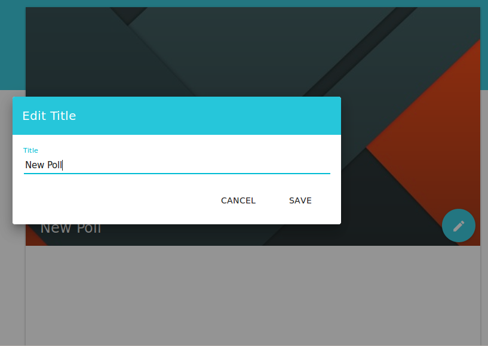

# Phase 3 Project Report

Welcome to the report of the TWEB Project phase 3. This is where you will find information about specification changes, what has been implemented during the last phase, known issues and a general conclusion about the work that has been done during the project with specific comments on its last update.

## Administrative information

### Team

Last name, first name | Github ID                                   |
----------------------|---------------------------------------------|
d'Agostino, Eléonore  | [paranoodle](https://github.com/paranoodle) | 
Ghozlani, Karim       | [gweezer7](https://github.com/gweezer7)     | 
Kammoun, Yassin       | [yibnl](https://github.com/yibnl)           | 
Ntawuruhunga, Paul    | [paulnta](https://github.com/paulnta)       | 

### Links

* [Polliwog web application](http://polliwog-app.herokuapp.com).
* [Polliwog REST API](http://polliwog-app.herokuapp.com/api).
* [Polliwog REST API Documentation](https://github.com/paulnta/Teaching-HEIGVD-TWEB-2015-Project/tree/master/api).
* [Polliwog product page](http://paulnta.github.io/Teaching-HEIGVD-TWEB-2015-Project/).
* [Mockups user interface](https://invis.io/6Y59VQVK7).

> The REST API Documentation link redirects to a basic markdown description of the API. However, both HTML and RAML version with more content can be found on the same location.

## Table of Contents
1. [Introduction](#Intro)
1. [User Guide](#Guide)
    1. [Speaker Side](#Speaker)
    1. [Audience Side](#Audience)
1. [Design](#Design)
    1. [Database](#Database) 
    1. [REST API](#RestAPI)
1. [Testing and validation](#Testing)
    1. [Test strategy](#Strategy)
    1. [Tools](#Tools)
    1. [Procedures](#Procedures)

## <a name="Intro"></a> Introduction

## <a name="Guide"></a> User Guide

Upon accessing the site root, the user will be greeted with a choice between a speaker or audience page:

[](images/landing.png)

We will first cover the speaker side, and late the audience side.

### <a name="Speaker"></a> Speaker Side

Selecting the speaker side will lead to a login page if the user is not already logged in:

[](images/login.png)

If the user already has an account, they may login. If not, there is a link to a page on which they can sign up to Polliwog. Attempting to login without entering any credentials leads to this error:

[](images/login_error.png)

If the user wishes to sign up, they are expected to enter a name for the site to address them as, an email address that will be used to log in, bypassing the need for a username, and a password. Passwords are required to be at least three characters long, and an error (similar to those illustrated above) will be displayed.

[](images/signup.png)

After signing up, the user is then returned to the login page where they may use their newly obtained account.

Upon logging in, the user is greeted by a landing page, containing a menu that displays all the lectures they have created. For this example, we are using a speaker that has previously created lectures.

[](images/speaker_landing.png)

To continue, the speaker can simply click on the lecture they'd like to see, or create a new one by clicking the "+ Lecture" button in the menu, which brings up this dialog:

[](images/lecture_new.png)

Having created their new lecture, the user is presented with the "share" tab, which displays the lecture key used by this lecture, necessary to allow audience members to connect to it.

[](images/lecture_share.png)

Having created a new lecture, the user can then click on it to bring up the lecture's overview:

[](images/lecture_landing.png)

If the user navigates to the "poll" tab, they can access the list of polls that has been created for this lecture. Since this is a new lecture, it does not have any polls, and as such the user will have to create a new one using the large "+" button in the bottom-right corner:

[](images/poll_new.png)

This bring up a dialog box to request a name for this new poll. Having given it a name, the user now has an empty poll to work with:

[](images/poll_empty.png)

The user can then start adding questions to it by clicking on the edit button and selecting "add question":

[](images/poll_options.png)

This opens a dialog box to name the question, and decide on the possible choices for it. New choices are added with the "+" button in the bottom-left corner, or existing choices can be removed with the "X" to the right of them. If the user would like to set some choices as "correct", they may click on the checkbox to the left of them. Saving the question returns the user to the previous poll screen, now with a new question added.

[](images/poll_question.png)

If the user returns to the poll overview page, they can see their new poll displayed:

[](images/poll_overview.png)

They can click on the vertical "..." to open poll options, such as editing, deleting, or "starting" the poll. That is, sending the poll to all the audience members connected to this lecture so that they may respond to it.

On the poll overview, the user can select a poll, that will be displayed on the right side of the screen, to allow for viewing without having to go into a new page for each poll. Next to the question choices, a number is displayed corresponding to the number of times audience members have selected that choice.

### <a name="Audience"></a> Audience Side

The audience landing page is very simple: It does not display anything until you have entered which lecture you would like to join. Having obtained a lecture key, the user can simply enter it in this field to join:

[](images/audience_landing.png)

Once the lecture has been joined, the user can simply wait for polls to appear on their screen, and answer them as they do. Leaving the lecture is as simple as closing the tab.

[](images/audience_join.png)

To use the example we showed previously on the speaker side, we would see a poll appear as such:

[](images/audience_poll.png)

## <a name="Design"></a> Design

### <a name="Database"></a> Database

#### Data model


*Note that the purpose of the different types of strokes is just to make the figure more readable.*

Changes have been made to the data model. Firstly, *Resource* and *Mood* entities were removed. This removal is justified by the fact that they were minor features unnecessary for the core of the system. It was decided to give priority to the main features of the application for reasons of schedule feasibility.

The *Lecture* entity was subject to a property addition whith is the *slug*property. A user (speaker) would certainly expect to access one of its lecture by its name through an URL. However, URLs are governed by naming rules which prohibit the use of some particular characters like the space one. A lecture name should therefore be adapted in order to be used through an URL. This is where the *slug* property becomes useful since its consists of the lecture name on which prohibited characters are replaced by allowed one. 

Assume that a lecture is named *HEIGVD TWEB 2015 Lecture1* for example. The "slug" process would convert this name as *HEIGVD-TWEB-2015-Lecture1*. A speaker would be able to access his lecture by entering the slug equivalent of its name as part of the URL.

It was decided before to take the relational database's traditional approach in which references are used to establish relations between entities. This is still applied but only for *Lecture* and *Poll* entities. The *Question* one does not store an array of choice references anymore. Since a user (speaker) would create a question and its choices at the same time, this creation must be done in only one process. To do so, the *Question* entity uses now an array of choice subdocuments. This facilitates both the creation and the update of questions. The same comments can be applied for a choice.

Given the fact that a choice is now a subdocument of a question, the *Choice* entity does not need to store a reference to its question anymore.

#### Document structures

Some document structures were subject to modifications from the second phase of the project. Here are reminded the document structures of the database with the new ones.

**Users**
```javascript
{
  name: String,
  email: String,
  role: String,
  hashedPassword: String,
  provider: String,
  salt: String,
  facebook: Object,
  twitter: Object,
  google: Object,
  github: Object
}
```

*Example*
```javascript
{
  name: 'Speaker',
  email: 'speaker@speaker.com',
  role: 'user',
  hashedPassword: 'qBjLmf3fkD323QegJH4Tody2LV2YvJ0S+lKdXfVxlAXm54H1fyj50KPAX9i+7RFfAGQRCXAZvZXxzqDfbJgIDA==',
  provider: 'local',
  salt: 'YyzmR4E2Zj6YporgyeOF9Q=='
}
```

**Lectures**
```javascript
{
    _id: <ObjectId>,
    key: String,
    name: String,
    slug: String,
    description: String,
    creationDate: Date,
    isPrivate: Boolean,
    speaker: <ObjectId>,
    listeners: [<ObjectId>],
    polls: [<ObjectId>]
}
```

*Example*
```javascript
{
    _id: 123e3f895,
    key: 'BF2DG',
    name: 'HEIGVD TWEB 2015 Lecture1',
    slug: 'HEIGVD-TWEB-2015-Lecture1',
    description: 'Introducing TWEB course to students',
    creationDate: 2015-11-02 17:00,
    isPrivate: false,
    speaker: 2233454,
    listeners: [422334578, 22357],
    polls: []
}
```

An additionnal property was added to the *Lecture Schema* which is  the *slug* property. The value that its stores is similar to the lecture name with the only difference being that it is converted as such it is possible to use it in the lecture URL.

**Polls**
```javascript
{
    _id: <ObjectId>,
    lecture: <ObjectId>,
    title: String,
    creationDate: Date,
    state: String,
    questions: [<ObjectId>]
}
```

*Example*
```javascript
{
    _id: 345ae2224df,
    lecture: 1225578,
    title: 'api-copilot-2015',
    creationDate: 2015-11-02 17:00,
    state: 'active',
    questions: [422334578, 2233454, 22357]
}
```

**Questions**
```javascript
{
    _id: <ObjectId>,
    poll: <ObjectId>,
    title: String,
    type: String,
    choices: [Choice]
}
```

A question does not store references of choices. An array is still used. However, it is choice subdocuments which are persisted instead of choice ids. This change facilitates both creation and update of questions as such choices.

*Example*
```javascript
{
    _id: 422334578,
    poll: 345ae2224df,
    title: 'What is a scenario?',
    type: 'reminder',
    choices: [
        {
            _id: 12347,
            key: 'a',
            text: 'A sequence of steps that you define using the step method.',
            answer_count: 3
        }
    ]
}
```
***

**Choices**
```javascript
{
    _id: <ObjectId>,
    key: String,
    text: String,
    answer_count: Number
}
```

The *Choice Schema* does not store a reference to its related question any more. This is due to the fact that a choice is now a subdocument of a question.

*Example*
```javascript
{
    _id: 12347,
    key: 'a',
    text: 'A sequence of steps that you define using the step method.',
    answer_count: 3
}
```
***

> The document structures of Moods and Resources entities were removed since they were not used in the system any more. The reason for that is due to the fact that the related features were not implemented during the last phase of the project.

## <a name="Testing"></a> Testing and validation

The second phase of the project was subject to integration problems between the client part and the server part. This last part begun with an initial testing and validation step in order to test and validate what was done previously. 

### <a name="Strategy"></a> Test strategy

The approach used to test and validate the integration of the server part with the client part of the system was done by following these steps:

1. Database population with test data.
1. Assertion testing on API resources.

### <a name="Tools"></a> Tools

* [API Copilot](https://github.com/AlphaHydrae/api-copilot), for database population.
* [Supertest](https://github.com/visionmedia/supertest), for assertion testing.
* [Should.js](https://github.com/shouldjs/should.js) for assertion testing.

### <a name="Procedures"></a> Procedures

#### Scenarios

##### Scenario: Init  

The goal of this scenario is to generate a huge volume of data. These data mainly consist of lectures, questions and choices. This is used to verify whether or not POST actions sucessfully create data.

File: [Init.scenario.js](https://github.com/paulnta/Polliwog/blob/master/Polliwog/server/api/Init.scenario.js)

##### Scenario: Remove

The goal of this scenario is to generate a few data which then are subject to DELETE HTTP requests. This is used to verify whether or not it is possible to a remove a particular data.

File: [Remove.scenario.js](https://github.com/paulnta/Polliwog/blob/master/Polliwog/server/api/Remove.scenario.js)

##### Scenario: RemoveAll

The goal of this scenario is to submit DELETE HTTP requests in order to delete every data related to any resource of the REST API. This is used to verify whether or not DELETE actions sucessfully delete data.

File: [RemoveAll.scenario.js](https://github.com/paulnta/Polliwog/blob/master/Polliwog/server/api/RemoveAll.scenario.js)

#### Assertion Testing

##### Lecture

The goal of this assertion testing is to verify whether or not a slug is added to a lecture when it is created and updated when it is modified.

File: [lecture.model.spec.js](https://github.com/paulnta/Polliwog/blob/master/Polliwog/server/api/lecture/lecture.model.spec.js)

##### Poll

The goal of this assertion testing is to verify whether or not a poll is added to a lecture when it is created.

File: [poll.model.spec.js](https://github.com/paulnta/Polliwog/blob/master/Polliwog/server/api/poll/poll.model.spec.js)

##### Question

The goal of this assertion testing is to verifiy whether or not it is possible to create questions.

File: [question.model.spec.js](https://github.com/paulnta/Polliwog/blob/master/Polliwog/server/api/question/question.model.spec.js)

##### Choice

The goal of this assertion testing is to verifiy whether or not choices are added, updated or deleted when the same events occur on related questions.

File: [choice.model.spec.js](https://github.com/paulnta/Polliwog/blob/master/Polliwog/server/api/choice/choice.model.spec.js)

## <a name="Issues"></a> Known Issues

## <a name="Conclusion"></a> Conclusion